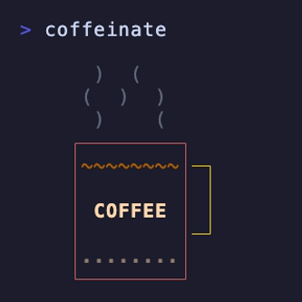

# coffeinate

<p align="center">
  
</p>

Keep your Mac awake, with style. A small wrapper around `/usr/bin/caffeinate` that adds a friendly prompt animation and a few ergonomic flags. Anything that works with `caffeinate` works here.

## Install

```
brew install genericJE/tools/coffeinate
```

Or grab the script directly:

```
curl -L https://raw.githubusercontent.com/genericJE/coffeinate/main/coffeinate -o /usr/local/bin/coffeinate
chmod +x /usr/local/bin/coffeinate
```

## Usage

```
coffeinate [options] [command ...]
```

| Flag | Effect |
|------|--------|
| `-d` | Prevent display sleep (default) |
| `-i` | Prevent idle sleep |
| `-m` | Prevent disk idle sleep |
| `-s` | Prevent sleep (AC power only) |
| `-u` | Declare user active |
| `-t <mins>` | Timeout in minutes |
| `-T <HH:MM>` | Shut down at given time |
| `-w <pid>` | Wait for a process to exit |
| `-q` | Silent mode (no animation, no output) |
| `-h` | Show help |

Press Ctrl-C to stop.

## License

MIT.

If anything here ends up being useful to you and you feel like saying thanks, my PayPal is https://paypal.me/genericJE. Truly no expectation either way, just leaving the option here in case.
